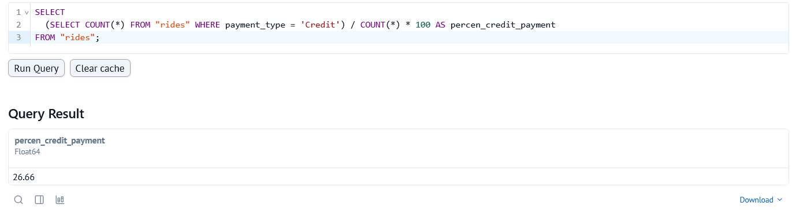
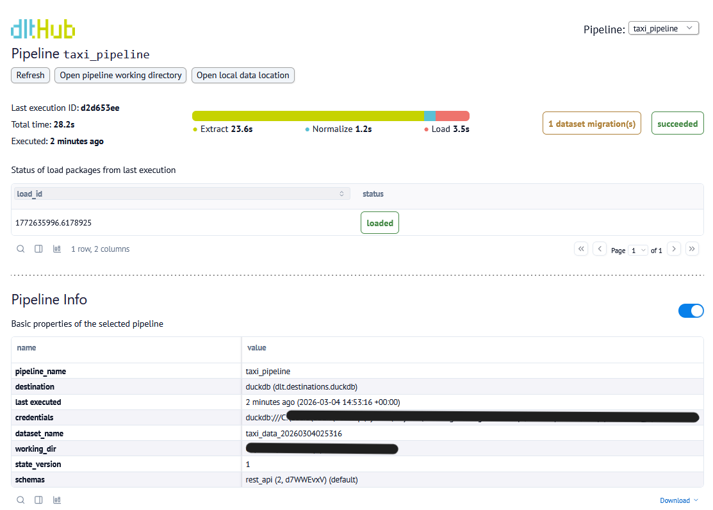

## dlt Workshop
This repository consists of an end-to-end data pipeline ingesting and loading NYC Taxi Data from a paginated JSON API into DuckDB. Open-source python based data loading tool [dlt](https://github.com/dlt-hub/dlt) is used for this process. The loaded data is then queried both with local duckdb and [marimo](https://github.com/marimo-team/marimo), a reactive python notebook.

The code is created with Claude MCP. See [CLAUDE.md](taxi-pipeline/CLAUDE.md) for the instructions given to Claude.

- **Source**: [NYC Taxi API](https://us-central1-dlthub-analytics.cloudfunctions.net/data_engineering_zoomcamp_api)
- **Pagination**: Page-number based, 1,000 records per page, stops on empty page
- **Destination**: DuckDB (`taxi_pipeline.duckdb`)
- **Records loaded**: 10,000 rides

### dlt-dashboard & marimo
Pipeline execution can be inspected through dlt-dashboard:


SQL queries can be run through dlt dashboard of marimo. An example query is shown below to find the answer for _Proportion of trips paid by credit card_:


To run the pipeline:

```bash
cd taxi-pipeline
python taxi_pipeline.py 
```
